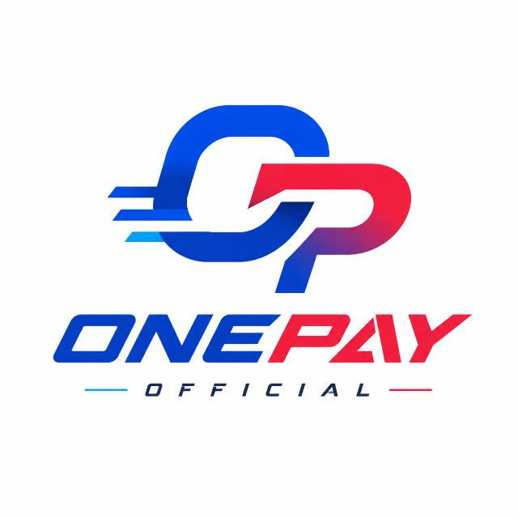
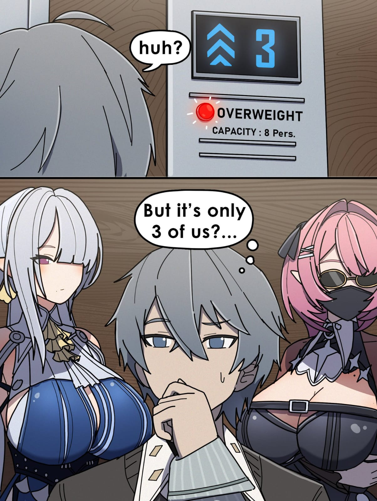

<div align="center">



# ONEPAY


<br>


<br><br>


</div>

## ONEPAY

**ONEPAY** adalah bot WhatsApp berbasis **Node.js + Baileys** untuk kebutuhan toko digital, automation, dan workflow pembayaran.

Project dibuat modular supaya pengembangan fitur tetap rapi melalui handler, plugin, database, template, dan library internal.

<div align="center">




</div>

## Features

- WhatsApp automation dengan Baileys
- Pairing code untuk koneksi WhatsApp
- Handler modular
- Sistem plugin
- Database terpisah
- Template pesan
- Image processing dengan Jimp
- Audio/video processing dengan FFmpeg
- File type detection
- WebP processing
- Logging dengan Pino
- File watching dengan Chokidar
- ES Modules
- Siap dikembangkan untuk toko digital dan payment workflow

## Tech Stack

| Technology | Fungsi |
| --- | --- |
| Node.js | Runtime utama |
| JavaScript | Bahasa pemrograman |
| Baileys | WhatsApp connection & messaging |
| Pino | Logging |
| Jimp | Image processing |
| FFmpeg | Audio/video processing |
| Chokidar | File watching |
| Haruka Lib | Library pendukung |

## Project Structure

```text
ONEPAY/
├── database/          # Database & data storage
├── lib/               # Helper & internal modules
├── media/             # Image, QR & media assets
├── plugins/           # Bot features / plugins
├── templates/         # Message templates
├── config.js          # Main configuration
├── handler.js         # Message handler
├── index.js           # Bot entry point
├── package.json       # Dependencies & scripts
├── package-lock.json  # Locked dependency versions
├── ONEPAY.zip         # Project archive
└── LICENSE
```

## Installation

### Requirements

- Node.js 20+
- npm
- FFmpeg
- Git

### Setup

```bash
git clone https://github.com/nexacodeid/ONEPAY.git
cd ONEPAY
npm install
npm start
```

Untuk koneksi pertama, bot akan meminta nomor WhatsApp dan mencoba mengirim **pairing code**.

## Configuration

Konfigurasi utama berada di:

```text
config.js
```

Pastikan file konfigurasi dan data yang dibutuhkan sudah tersedia sebelum menjalankan bot.

## Media

Repository sudah memiliki asset asli di folder `media/`, termasuk logo ONEPAY, preview bantuan, preview produk, dan QR. README menggunakan asset repository secara langsung agar gambar tidak bergantung sepenuhnya pada layanan banner eksternal.

## Development

```text
plugins/       -> tambah atau ubah fitur bot
handler.js     -> alur pemrosesan pesan
lib/           -> helper dan modul internal
database/      -> penyimpanan data
templates/     -> template pesan
config.js      -> konfigurasi
```

## Disclaimer

Project ini dibuat untuk pengembangan, pembelajaran, dan automation WhatsApp secara bertanggung jawab.

Jangan gunakan project untuk spam, penipuan, penyalahgunaan akun, atau aktivitas yang melanggar kebijakan platform maupun hukum yang berlaku.

## Author

<div align="center">


### NEXACODE ID


<br><br>


</div>

## Support

Gunakan **Issues** atau **Pull Requests** untuk melaporkan bug dan mengembangkan fitur.

<div align="center">


**ONEPAY • Automate. Integrate. Scale.**

</div>
